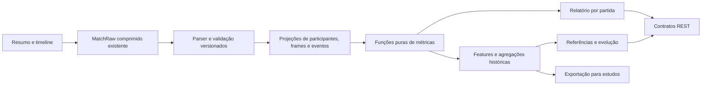

# Métricas e oportunidades — produto, arquitetura e plano de execução

Análise do par `exemplo_partida_BR1_3200579475.json` e `exemplo_partida_timeline_BR1_3200579475.json`, cruzada com a implementação do backend. Levantamento inicial: 18/09/2026. **Revisão de arquitetura, produto e planejamento: 22/09/2026, código-base `fc7abf5`.** As seções 1–7 registram evidências, oportunidades e limites; as seções 8–10 definem produto e arquitetura; as seções seguintes detalham contratos, entregas e tarefas no kanban-tui.

O projeto já oferece perfis, histórico, agregados e comparações. A próxima etapa proposta é explicar **como o jogador contribuiu, quais momentos merecem revisão e como seu desempenho evolui em contextos comparáveis**. São 60 oportunidades: 56 do levantamento original e quatro extensões históricas identificadas nesta revisão. O MVP prioriza explicações por partida; análises históricas dependem de cobertura mensurada.

Este trabalho altera documentação e artefatos de auditoria offline. Não implementa as funcionalidades planejadas nem comprova o estado de implantação ou o volume do banco em produção. O checkout contém somente o backend; entregas de interface abaixo são contratos e especificações para o consumidor, sem presumir um frontend existente.

## 1. O que foi efetivamente analisado

Os dois arquivos identificam a mesma partida `BR1_3200579475`, com os mesmos dez participantes. O resumo registra fila 420, mapa 11, versão `16.2.741.3171`, duração de 2.368 segundos (39:28) e vitória do time 100. O evento `GAME_END` confirma esse vencedor; seu relógio é 2.368.922 ms, mais preciso que o inteiro do resumo.

Foram percorridos todos os valores dos JSONs: 41 frames, 410 snapshots de participantes, 1.966 eventos de 18 tipos, 146 nomes de campos no nível de participante e 138 nomes de campos em `challenges` na união dos dez jogadores. Campos de challenges são opcionais: cada participante tem entre 126 e 131, não todos os 138. O inventário recursivo encontra 342 caminhos de campos no resumo e 109 na timeline, normalizando índices de arrays e IDs dos snapshots; são caminhos distintos, não quantidade de valores.

Artefatos reproduzíveis:

- [Script de análise](../scripts/analyze-example-match.py): Python padrão, sem serviços externos ou dependências adicionais.
- [Resultados e definições em JSON](analysis/BR1_3200579475.metrics.json): times, jogadores, checkpoints, objetivos, janelas temporais, validações e hashes dos arquivos de origem.
- [Inventário completo de campos e retenção no backend](analysis/BR1_3200579475.fields.csv).
- [Série temporal de ouro, abates e wards](analysis/BR1_3200579475.timeline.csv).

Reprodução: `python3 scripts/analyze-example-match.py`, a partir da raiz do repositório. O script também funciona quando chamado por caminho absoluto. A auditoria de retenção é estática, baseada nos parsers e na persistência ativos; precisa ser revisada quando esses componentes mudarem. Desde o processamento confiável, os dois payloads completos são guardados em `MatchRaw`. “Descartado”, “ignorado” ou “não retido” nas descrições de parsers significa **ausente da projeção analítica**, não perdido no armazenamento bruto. Isso permite reconstrução sem nova chamada à Riot quando o par bruto da partida estiver disponível.

## 2. A partida já revela um produto mais interessante que o placar

| Medida | Time 100 — vencedor | Time 200 — perdedor |
|---|---:|---:|
| Abates | 40 | 52 |
| Ouro final | 88.606 | 78.613 |
| Dano a campeões | 232.227 | 189.529 |
| Dano a torres | 36.129 | 29.920 |
| Torres destruídas | 7 | 6 |
| Dragões | 3 | 3 |
| Barões | 0 | 2 |
| Arautos | 0 | 1 |
| Vastilarvas, conforme `horde.kills` | 0 | 3 |
| Wards colocadas, reconciliadas | 109 | 87 |
| Wards destruídas | 18 | 33 |
| Control wards colocadas | 9 | 12 |
| Control wards compradas | 9 | 14 |
| Soma de vision score | 213 | 269 |
| Cura em aliados | 16.618 | 12.870 |
| Escudos em aliados | 19.049 | 4.071 |
| Tempo morto somado dos jogadores | 1.811 s | 1.365 s |

O vencedor teve menos abates, menos vision score e nenhum Barão. Isso não demonstra que abates, visão ou Barão não importam. Demonstra que uma análise individual precisa mostrar outras dimensões: distribuição de recursos, pressão em estruturas, momento das mortes e aproveitamento das vantagens.

O tempo morto somado é expresso em jogador-segundos: períodos podem se sobrepor. Não representa 1.811 segundos com o time inteiro morto. Cura/escudo somados são contribuições registradas, não estimativa de mortes evitadas.

### A armadilha das 752 wards

| Contagem na timeline | Time 100 | Time 200 | Total |
|---|---:|---:|---:|
| Todo evento `WARD_PLACED` | 154 | 598 | 752 |
| Eventos `UNDEFINED` | 45 | 511 | 556 |
| Tipos de ward identificados | 109 | 87 | 196 |
| `wardsPlaced` do resumo | 109 | 87 | 196 |

Os tipos identificados nesta amostra são `YELLOW_TRINKET`, `BLUE_TRINKET`, `SIGHT_WARD` e `CONTROL_WARD`. A exclusão dos 556 `UNDEFINED` reconcilia as contagens **para cada um dos dez jogadores**, não apenas para os times. A Zyra concentra 434 eventos indefinidos, Zoe 77 e Milio 45. Os arquivos não explicam a semântica exata desses eventos; não os classificamos como plantas, habilidades ou wards convencionais por suposição.

Uma implementação ingênua diria que o perdedor colocou quase quatro vezes mais wards. A contagem reconciliada mostra o contrário: o vencedor colocou 22 a mais. Portanto, a primeira métrica nova deve vir acompanhada de uma regra de qualidade, e tipos desconhecidos devem permanecer separados para investigação.

Também não basta trocar quantidade por vision score: o time que colocou menos wards teve maior soma de vision score e mais remoções. São dimensões distintas. Aqui, `knownWardsPerTeamMinute` é 2,762 contra 2,204, dividindo pela duração da partida, sem dividir novamente pelos cinco jogadores.

### Como a vantagem mudou

| Snapshot aproximado | Ouro: time 100 menos time 200 | Abates 100–200 |
|---|---:|---:|
| 22:00 | −4.750 | 15–31 |
| 28:00 | +455 | 22–39 |
| 30:00 | +4.566 | 28–42 |
| 35:00 | +3.924 | 32–48 |
| Final, 39:28 | +9.993 | 40–52 |

A maior desvantagem de ouro observada nos snapshots foi 4.750. A partir do snapshot de 28:00, todos os snapshots restantes mostram vantagem do time 100. Não é possível afirmar o segundo exato da virada entre frames; a série tem resolução próxima de um minuto.

No primeiro Barão, às 20:44, o time 200 havia registrado cinco abates e nenhuma morte nos 60 segundos anteriores. Comparando os snapshots de 20:00 e 23:00, sua vantagem cresceu de 1.744 para 4.350: +2.606. No segundo Barão, às 32:28, a diferença desse time passou de −3.373 em 32:00 para −3.924 em 35:00: piora de 551.

Isso é **variação de ouro do mapa em uma janela que contém a captura**, não “ouro gerado pelo buff do Barão”. Inclui farm, torres, recompensas e ações de todos os jogadores; não identifica portadores ou duração efetiva do buff. A comparação é útil para levantar a pergunta “o que aconteceu depois do objetivo?”.

Outro exemplo de resposta no mapa: o time 200 destrói o inibidor do meio às 22:18; 5,377 segundos depois, Fiora destrói uma torre interna do top do time 200. A sequência permite mostrar troca de estruturas em lados diferentes do mapa. Sozinha, não prova que a troca foi planejada ou vantajosa.

### Uma leitura por jogador

KP = `(kills + assists) / kills do time`. Ouro@15 é diferença contra o adversário da mesma posição. O snapshot usado para @15 está em 15:00,358, explicitado no JSON de resultados.

| Jogador | Time | K/D/A | KP | Wards colocadas / removidas | Ouro@15 | CS@15 diferencial | % do jogo morto |
|---|---:|---|---:|---:|---:|---:|---:|
| Fiora | 100 | 19/5/7 | 65,0% | 13 / 4 | +3.088 | +38 | 9,0% |
| Karthus | 100 | 4/9/16 | 50,0% | 16 / 1 | +692 | 0 | 13,7% |
| Quinn | 100 | 13/18/3 | 40,0% | 14 / 4 | −605 | −19 | 25,7% |
| Varus | 100 | 3/8/17 | 50,0% | 20 / 3 | −394 | −7 | 10,3% |
| Milio | 100 | 1/12/20 | 52,5% | 46 / 6 | +59 | −3 | 17,8% |
| Singed | 200 | 9/9/6 | 28,8% | 16 / 4 | −3.088 | −38 | 11,2% |
| Aatrox | 200 | 12/8/7 | 36,5% | 10 / 8 | −692 | 0 | 13,0% |
| Zoe | 200 | 16/8/15 | 59,6% | 9 / 8 | +605 | +19 | 13,1% |
| Zyra | 200 | 15/7/14 | 55,8% | 9 / 3 | +394 | +7 | 10,5% |
| Zilean | 200 | 0/8/30 | 57,7% | 43 / 10 | −59 | +3 | 9,8% |

Quatro narrativas que o produto já poderia sustentar:

- **Fiora converte recursos em pressão de estruturas:** 28,06% do ouro do time, 34,98% do dano a campeões e **79,14% do dano a torres**. Foram 28.592 de dano a torres, quatro torres finalizadas e seis abates sem assistentes registrados antes dos 15 minutos. É evidência de contribuição em estruturas; “split push eficiente” exigiria definição temporal/espacial adicional.
- **Milio tem uma contribuição que DPM não captura:** 13.741 de cura em aliados, 19.049 de escudos, 46 wards e 52,5% de KP. Julgá-lo pela participação de 2,51% no dano do time apagaria boa parte de sua função.
- **Quinn merece uma análise de janelas de morte:** 608 segundos morto, 25,7% da partida; oito mortes precedem ao menos um objetivo adversário em até 60 segundos pela definição do script. As janelas podem sobrepor; isso é associação temporal e não atribuição de culpa. O total de 13 abates sozinho não mostra esse contexto.
- **Zyra entrega dano mesmo na derrota:** 36,68% do dano do time com 23,76% do ouro. A razão entre essas participações é aproximadamente 1,54. Essa medida descreve produção relativa de dano; não é nota de habilidade nem corrige diferenças de campeão, dano de poke e composição.

Há ainda um cuidado com métricas de sobrevivência: Karthus recebe um abate registrado **4,026 segundos depois de sua própria morte** no final da partida. Uma regra universal que trate toda morte como fim imediato de contribuição ou todo dano sofrido como desempenho ruim seria inadequada.

## 3. O que já existe e o que apenas parece existir

| Família | Situação atual do projeto |
|---|---|
| K/D/A, resultado, ouro, dano a campeões, dano recebido e vision score | Persistidos; KDA e métricas por minuto são calculados |
| Gráficos de ouro, XP, CS e dano | Persistidos por participante; API usa ouro por time e médias de ouro/CS na comparação |
| CSD/GD/XPD aos 15 | Agregados já usam `laningSamples` e retornam `null` sem amostra válida; usam primeiro frame em `[900000,960000)`. Faltam exposição por partida e contrato comum de checkpoints |
| Win rate, desempenho por campeão, posições e atividade | Já existem; não são propostas novas |
| Abates e mortes no mapa | Coordenadas/timestamps retidos; vínculo explícito killer–victim, assistentes e contexto de recompensa descartados |
| Wards | Colocações retidas com `wardType`, incluindo indefinidos; coordenadas inventadas como `(0,0)`; remoções não são persistidas pelo handler |
| Objetivos | Persistência já grava eventos em `MatchTeam.objectivesTimeline` com o beneficiário correto; totais finais permanecem somente no bruto. Faltam identidade de origem, assistentes, tier da estrutura e análises dedicadas |
| Itens | Compras/vendas e undo parcialmente retidos; slots finais não são salvos, e build calculada a partir de compras não reconstrói inventário |
| Habilidades | Sequência Q/W/E/R retida, sem timestamp; evolução do nível do campeão descartada |
| `challenges` | JSON inteiro é salvo e pode aparecer no detalhe bruto; não há análises dedicadas para a maioria dos seus campos |
| Runas e pings | Retidos como JSON; não há análises de desempenho por escolha de runa ou comportamento de comunicação |
| Solo kills/deaths aos 15 na comparação | Campos retornam zero fixo, apesar de eventos suficientes para uma contagem explícita |
| Processamento e reconstrução | `MatchRaw` comprimido, posse com token, retries, commit transacional de partida/agregados e rebuild offline versionado já implementados; devem ser reutilizados |
| Vencedor na timeline de ouro | `determineWinner` infere pelo saldo de ouro final; deve usar resultado de `MatchTeam.win` |
| Comparação entre jogadores | `role` filtra timelines, mas não os agregados gerais/lane; timelines têm `take: 100` sem ordenação. Falta garantir o mesmo recorte e mostrar N por ponto |
| Performance por partida | CSPM usa último elemento de `csGraph`, enquanto agregados usam `totalCs`; `survivability` é apenas diferença de dano recebido por minuto |
| Popularidade de campeões | `pickRate`/`banRate` existem no schema e entram no tier, mas o writer atual não os incrementa; defaults zero não medem ausência real de picks/bans |

Os fundamentos concluídos acima **não geram tarefas de reimplementação**. As novas tasks tratam extensão, correção de contrato e validação. O scheduler do collector também já foi corrigido para seis campos e verifica `APP_MODE=COLLECTOR`. O [onboarding](ONBOARDING.md) contém descrições históricas; para processamento, prevalecem o [guia atualizado](PROCESSAMENTO-CONFIAVEL.md) e o código inspecionado.

Referências de código: [parser de partida](../src/modules/worker/pure/match.parser.ts), [parser de timeline](../src/core/riot/timeline-parser.service.ts), [persistência](../src/modules/worker/services/match-persistence.service.ts), [agregações](../src/core/stats/player-stats-aggregation.service.ts), [analytics](../src/modules/analytics/services/analytics.service.ts), [performance](../src/modules/matches/pure/performance-calculator.ts).

## 4. Catálogo priorizado de oportunidades

Legenda de disponibilidade:

- **Banco:** derivável das projeções atualmente persistidas, após conferir qualidade e modalidade.
- **JSON bruto:** campo já salvo em `challenges`/runas/pings, sem análise dedicada; o par completo também existe em `MatchRaw` no novo pipeline.
- **Ingestão:** exige promover campos do bruto, ampliar o parser ou corrigir projeções; não implica nova chamada à Riot para partidas com `MatchRaw` completo.
- **Estimativa:** precisa de convenção explícita, limiar ou informação adicional; não equivale a uma observação direta.

P0 = corrigir/viabilizar fundamentos; P1 = alto valor para primeira versão analítica; P2 = expansão após validar a base. “P” indica jogador; “T”, time; “H”, análise histórica. As prioridades são propostas de produto, não medições de impacto.

### Visão e controle de informação

| ID / prioridade | Métrica e nível | Fonte / cálculo | Disponibilidade e limite |
|---|---|---|---|
| V01 / P0 | Wards colocadas por tipo e fase — P/T | `WARD_PLACED.creatorId`, `wardType`, timestamp; reconciliar com `wardsPlaced` | Banco para colocações, após filtrar tipos identificados; manter desconhecidos separados |
| V02 / P1 | Wards removidas por tipo e fase — P/T | `WARD_KILL.killerId`; total `wardsKilled` | Ingestão; `challenges.wardTakedowns` já oferece total alternativo |
| V03 / P1 | Control wards compradas e colocadas — P/T | `visionWardsBoughtInGame`, `detectorWardsPlaced`, eventos | Compra exige ingestão; colocação também recuperável de eventos/challenges; compra não é colocação |
| V04 / P1 | Participação individual na visão do time — P | `visionScore / soma do time`; também participação nas colocações/remoções | Banco para score/colocação; distinguir visão pontuada de quantidade |
| V05 / P1 | Frequência de ward e maior intervalo sem colocar — P | Contagem/tempo elegível e diferenças entre timestamps identificados | Banco; intervalo sem colocar não significa mapa sem visão ou trinket disponível |
| V06 / P1 | Atividade de visão antes de captura de objetivo — P/T | Colocações e remoções nos 60/90 s anteriores | Ingestão para remoções/objetivos; medida global do mapa, sem presumir visão no rio |
| V07 / P1 | Desvantagem de visão por fase — T | Diferença de V01/V02 em janelas fixas, ex. até 10/15/20 | Banco + ingestão; evitar usar totais finais como preditores de um instante anterior |
| V08 / P2 | Investimento/resultado de visão por posição — P/H | Control wards, score, colocações e remoções vs referência do mesmo campeão/role/patch | Ingestão + histórico; custo monetário depende das regras do patch e da quest |

O número de wards removidas pelo time dividido pelas wards colocadas pelo adversário pode ser um indicador descritivo, mas não deve ser chamado de “percentual de todas as wards inimigas destruídas” sem reconciliar tipos e regras de contagem. Não há ID de ward para ligar instalação e destruição nesta timeline.

### Lane, economia e progressão

| ID / prioridade | Métrica e nível | Fonte / cálculo | Disponibilidade e limite |
|---|---|---|---|
| E01 / P1 | CS, ouro e XP aos 5/10/20, além dos 15 já existentes — P/T | Snapshot no checkpoint e diferença vs adversário da mesma posição | Banco aproximado por arrays; preservar timestamp exato para o contrato novo |
| E02 / P1 | Farm de lane separado de jungle — P | `minionsKilled` e `jungleMinionsKilled`; final `totalMinionsKilled`, `neutralMinionsKilled` | Ingestão; atualmente CS junta componentes; challenges têm alguns recortes antecipados |
| E03 / P1 | Curva de ganho de recursos por fase — P/T | Diferença de gold/CS/XP entre frames, dividida pelo tempo real transcorrido | Banco; zeros faltantes não podem virar perda real; intervalo final não é minuto completo |
| E04 / P1 | Distribuição de recursos — P/T | Participação de ouro e CS; concentração no maior acumulador | Banco; descreve distribuição, não justiça da distribuição |
| E05 / P1 | Ouro não gasto nos snapshots — P/T | `currentGold`, máximo/mediana, proporção de snapshots acima de limiar | Ingestão; não usar `goldEarned − goldSpent`; não equivale a ouro desperdiçado |
| E06 / P2 | Recurso não gasto antes de episódio de combate — P | Snapshot anterior ao episódio + tempo desde snapshot | Ingestão + estimativa; não é inventário/caixa exato no segundo da luta |
| E07 / P1 | Nível e diferença de nível nos checkpoints — P | `participantFrames.level`; tempo até níveis observados em `LEVEL_UP` | Ingestão; limites dependem da versão/posição, não fixar 18 |
| E08 / P1 | Abates sem assistentes aos 10/15 e mortes equivalentes — P | `CHAMPION_KILL` sem `assistingParticipantIds`, com autor válido | Ingestão para vínculo completo; total final já em challenges; não comprova duelo isolado |
| E09 / P2 | Conversão da vantagem de lane — P/H | Relação entre lead@15 e ganho posterior de estruturas/recursos/resultado | Ingestão + histórico; estratificar campeão/role, duração e partida elegível |
| E10 / P2 | Recursos de jungle adversária e aliados — P | `totalEnemyJungleMinionsKilled`, `totalAllyJungleMinionsKilled`, challenges correspondentes | Ingestão / JSON bruto; não representa rota exata dos campos |

### Combate, sobrevivência e contribuição

| ID / prioridade | Métrica e nível | Fonte / cálculo | Disponibilidade e limite |
|---|---|---|---|
| C01 / P1 | Participação em abates (KP) — P | `(kills + assists) / kills do time`, total e por fase | Banco no total / ingestão por fase; denominador zero gera ausência, não bom desempenho |
| C02 / P1 | Participação no dano e razão dano/ouro — P | `damage / teamDamage`; dividir pela participação no ouro | Banco; referência por campeão/posição, sem rotular suporte como ineficiente |
| C03 / P1 | Distribuição do dano físico/mágico/verdadeiro — P/T | Campos `*DamageDealtToChampions` e `*DamageTaken` | Ingestão; mostra composição de dano efetivamente causado/recebido |
| C04 / P1 | Cura e escudos em aliados — P/T | `totalHealsOnTeammates`, `totalDamageShieldedOnTeammates`, por minuto | Ingestão; challenges oferecem `effectiveHealAndShielding`; separar cura própria |
| C05 / P1 | Controle de grupo — P/T | `timeCCingOthers`, `enemyChampionImmobilizations` | Ingestão / JSON bruto; `totalTimeCCDealt` tem outra semântica, não somar indiscriminadamente |
| C06 / P1 | Tempo morto — P/T | `totalTimeSpentDead / timePlayed`; soma em jogador-segundos | Ingestão; considerar campeão/posição e contribuição pós-morte |
| C07 / P1 | Mortes próximas a objetivos adversários — P | Objetivo em `(morte, morte+60s]`; lista de ocorrências e taxa por morte elegível | Ingestão; descrever associação; janelas sobrepostas não são perdas adicionais independentes |
| C08 / P1 | Recompensas de shutdown recebidas/cedidas — P/T | `shutdownBounty` dos eventos de abate; challenges `bountyGold` como medida distinta | Ingestão / JSON bruto; não somar `bounty` + `shutdownBounty` sem validar significado do patch |
| C09 / P1 | Quem matou quem e quem ajudou — P/P | Matriz killer–victim e rede de co-participação dos assistentes | Ingestão; mostrar relações nesta partida, não assumir premade ou intenção |
| C10 / P2 | Troca rápida após morte — P/T | Abate adversário após morte em janela de 10 s e região definida | Ingestão + estimativa; publicar limiares e evitar dupla atribuição |
| C11 / P2 | Episódios de abates agrupados — T | Agrupar kills por tempo/posição e medir saldo/participantes | Ingestão + estimativa; não captura lutas sem mortes, iniciação, peel ou todas as teamfights |
| C12 / P2 | Execução mecânica descritiva — P/H | `skillshotsHit`, `skillshotsDodged`, `outnumberedKills`, `saveAllyFromDeath` | JSON bruto; hits não fornecem tentativas suficientes para uma taxa universal de acerto |

### Objetivos, estruturas e recuperação

| ID / prioridade | Métrica e nível | Fonte / cálculo | Disponibilidade e limite |
|---|---|---|---|
| O01 / P0 | Cronologia auditável de objetivos — T | `ELITE_MONSTER_KILL` usa `killerTeamId`; `BUILDING_KILL.teamId` é dono da estrutura destruída | Persistência e beneficiário já corrigidos; estender identidade, totais separados e metadados |
| O02 / P1 | Participação em objetivos — P | Autor + `assistingParticipantIds`; dano final em épicos/estruturas como dimensão separada | Ingestão; assistente registrado não equivale a todos os presentes |
| O03 / P1 | Pressão em estruturas — P/T | Dano a torres, participação no time, `turretKills` e `turretTakedowns` | Ingestão; não confundir último golpe com participação |
| O04 / P1 | Eventos de placas por lane/fase/time — P/T | `TURRET_PLATE_DESTROYED`, posição, lane e dono da torre | Ingestão; 28/74 eventos têm killerId=0; não atribuir ouro inteiro ao último golpe |
| O05 / P1 | Abates seguidos de objetivo — T | Fração de abates/episódios elegíveis com captura em até 60/90 s | Ingestão; fixar unidade do denominador, permitir fim de jogo/objetivo indisponível como contexto |
| O06 / P1 | Variação de vantagem após objetivo — T | Diferença de ouro em frames antes/depois, com timestamp real | Banco + ingestão; contexto do mapa inteiro, não efeito causal/buff power play |
| O07 / P1 | Troca de objetivos entre times — T | Eventos opostos próximos no tempo, com tipo/lane | Ingestão; chamar de troca temporal, sem inferir planejamento |
| O08 / P1 | Maior déficit superado e manutenção da vantagem — T | Mínimo da diferença, mudanças de sinal e persistência nos snapshots | Banco; usar vencedor real, não inferido por ouro |
| O09 / P2 | Ouro acumulado durante vantagem e área sob a curva — T | Integrar diferença de ouro no tempo com regra explícita de interpolação | Banco; unidade ouro-minuto, não probabilidade de vitória |
| O10 / P2 | Janela de objective bounty — T | `OBJECTIVE_BOUNTY_PRESTART.actualStartTime` e FINISH | Ingestão; respeitar time, ausência/fim censurado e regras do patch |
| O11 / P2 | Roubo e contestação registrados — P/T | `objectivesStolen`, `epicMonsterSteals`, assists e challenges de proximidade | Ingestão / JSON bruto; não permite contar todas as tentativas falhadas |
| O12 / P2 | Recuperação por posição — P/H | Lead/deficit individual por fase + contribuição posterior ao time | Banco + ingestão; comparar amostras equivalentes, sem ranking universal de “carregou” |

### Builds, escolhas e comportamento

| ID / prioridade | Métrica e nível | Fonte / cálculo | Disponibilidade e limite |
|---|---|---|---|
| B01 / P0 | Inventário final correto — P | `item0..item6` **e `roleBoundItem`**; preservar slots | Ingestão; `roleBoundItem` pode ser item de quest ou equipamento, exige catálogo da versão |
| B02 / P1 | Tempo de aquisição de itens relevantes — P/H | Compras + vendas + destroyed + undo e catálogo por patch | Ingestão parcialmente existente; compra desfeita não é aquisição definitiva |
| B03 / P2 | Ordens de compra e escolhas situacionais — P/H | Sequências, campeão/role, recursos no instante e composição adversária | Ingestão + histórico/catálogo; win rate final por item tem viés de vantagem e duração |
| B04 / P1 | Ordem e timing de habilidades — P/H | `SKILL_LEVEL_UP` com timestamp, slot e tipo | Sequência no banco; timings exigem ingestão; não mede uso eficaz das habilidades |
| B05 / P2 | Runas e feitiços por matchup — P/H | `perks`, IDs de summoner spells, resultado e contexto | JSON bruto/banco; avaliar tamanho de amostra e seleção de jogadores |
| B06 / P2 | Frequência de casts na partida — P | Totais `spell1..4Casts`, `summoner1/2Casts`, divididos pela duração; não há log completo de casts na timeline | Ingestão; somente totais, sem inventar timestamps ou cooldowns desperdiçados |
| B07 / P2 | Perfil de comunicação descritivo — P/H | Contagem dos diferentes `*Pings`, normalizada pela duração | JSON bruto; pings não revelam intenção, qualidade da comunicação ou toxicidade |
| B08 / P2 | Presença amostrada em regiões do mapa — P | `pathingSample` e regiões versionadas por mapa | Banco + estimativa; amostra de 60 s não oferece tempo exato em cada região |

### Métricas históricas para orientar melhoria

| ID / prioridade | Métrica e nível | Fonte / cálculo | Disponibilidade e limite |
|---|---|---|---|
| H01 / P1 | Referência por campeão/posição/patch | Distribuição e percentis das métricas anteriores, com N e cobertura | Histórico; não misturar suporte com carry nem modalidades diferentes |
| H02 / P1 | Evolução do próprio jogador | Comparar janelas anteriores/posteriores sob filtros consistentes | Histórico; explicitar mudanças de campeão, patch e composição da amostra |
| H03 / P1 | Associação entre visão antecipada e vitória | Wards/remoções até t versus resultado, com contexto até t | Histórico; protocolo na seção 7; não causal |
| H04 / P2 | Conversão de vantagem de lane em vitória | Vitória condicional ao diferencial@15 por role/champion | Histórico; excluir partidas encerradas antes do checkpoint |
| H05 / P2 | Frequência de mortes antes de objetivos | C07 por morte/jogo, com oportunidades observadas e intervalos de incerteza | Histórico; evitar culpar um jogador pelo efeito do estado do time |
| H06 / P2 | Sinergias e confrontos observados | Coocorrência de campeões, lane opponent, resultados e contexto | Histórico; contagem de observações não prova sinergia causal e fragmenta amostra |
| H07 / P0 | Pick rate e ban rate observados, por patch/fila | Partidas distintas contendo pick/ban do campeão / partidas elegíveis | Banco: participantes e bans; corrigir taxas hoje não alimentadas e publicar denominador. Tier continua heurístico |
| H08 / P2 | Pool de campeões e consistência por contexto | Frequência, concentração no top 3, mediana e dispersão das métricas por campeão/posição | Banco + histórico; experiência observada não prova maestria, diversificação não é automaticamente melhor |
| H09 / P2 | Mudanças entre patches | Diferenças de distribuições, pick/ban e resultados em coortes comparáveis | Histórico; registrar composição e cobertura; antes/depois não identifica efeito causal do patch |
| H10 / P2 | Sessões e sequência de partidas | Ordenar por início/fim, separar sessões por intervalo parametrizado e comparar posição na sessão | Banco + histórico; importação parcial pode fragmentar sessões. Não inferir tilt, fadiga ou saúde |

São **60 oportunidades catalogadas**: 8 de visão, 10 de economia, 12 de combate, 12 de objetivos, 8 de escolhas e 10 históricas. Algumas são novas formas de expor dados já disponíveis; outras exigem projeções adicionais. O valor maior está em conectar famílias, por exemplo visão antes de objetivo + mortes na janela + troca de estruturas.

## 5. Campos/eventos a promover do bruto para análises

| Evento na amostra | Quantidade | Tratamento atual / informação adicional aproveitável |
|---|---:|---|
| `WARD_PLACED` | 752 | Retém tipo/tempo, mas mistura 556 indefinidos; não há coordenadas no evento |
| `WARD_KILL` | 51 | Handler não persiste; perder isso apaga remoção de visão por fase |
| `CHAMPION_KILL` | 92 | Retém posições, perde vínculo explícito, assistentes, recompensa e recap de dano |
| `CHAMPION_SPECIAL_KILL` | 12 | Ignorado; contexto de multikill e first blood |
| `ELITE_MONSTER_KILL` | 12 | Eventos já persistidos; promover assistentes, posição e identidade de origem |
| `BUILDING_KILL` | 15 | Eventos já persistidos; inclui 13 torres e 2 inibidores; promover tier, proprietário original e assistentes |
| `TURRET_PLATE_DESTROYED` | 74 | Ignorado; potencial de pressão por lane/tempo |
| `DRAGON_SOUL_GIVEN` | 1 | Ignorado; neste arquivo `teamId=0`, logo não atribuir uma alma a um time |
| `ITEM_PURCHASED` | 292 | Retido parcialmente; compras removidas durante processamento de undo |
| `ITEM_SOLD` | 19 | Retido; efeitos não considerados na aproximação atual de build final |
| `ITEM_DESTROYED` | 277 | Ignorado; composições/consumos/transições exigem semântica do item |
| `ITEM_UNDO` | 18 | Retém `beforeId` e tempo, perde `afterId` e `goldGain` |
| `SKILL_LEVEL_UP` | 177 | Mantém sequência sem timestamp |
| `LEVEL_UP` | 170 | Ignorado; curva de progressão e milestones de nível |
| `OBJECTIVE_BOUNTY_PRESTART` | 1 | Ignorado; início programado é diferente do timestamp do anúncio |
| `OBJECTIVE_BOUNTY_FINISH` | 1 | Ignorado; término da janela |
| `PAUSE_END` | 1 | Ignorado; informação de relógio, não prova duração de todas as pausas |
| `GAME_END` | 1 | Ignorado na timeline; útil para reconciliar vencedor e encerramento |

Nos snapshots, o backend preserva ouro acumulado, XP, CS total, dano a campeões e posição. Deixa de preservar `currentGold`, `level`, `timeEnemySpentControlled`, atributos do campeão e decomposição do dano. A retenção de timestamps deve acompanhar os valores: existem 41 frames, mas apenas 40 índices distintos de `floor(timestamp/60000)`; o último frame sobrescreve o anterior no índice 39 no parser atual.

No resumo, as prioridades são guardar totais de wards, dano a estruturas/épicos, cura/escudo aliados, tempo morto, tipos de dano, itens finais/roleBoundItem, dados de surrender e Riot ID. Todos os dez `summonerName` estão vazios; nomes de exibição estão em `riotIdGameName`/`riotIdTagline`.

Os tipos TypeScript também precisam acompanhar o payload observado: o recap de dano contém `magicDamage`, enquanto interfaces locais declaram `magicalDamage`; `victimDamageReceived` não oferece o `totalDamage` exigido pela interface. Um DTO declarado não comprova que aquele campo existe no JSON. Antes de criar métricas sobre esses recaps, usar validação do payload e testes de contrato com os campos reais.

`challenges` já contém várias oportunidades sem buscar novamente a Riot: KP, damage share, solo kills, bounties, takedowns de objetivos, farm inicial, wards por tipo, remoções, saves, immobilizações, skillshots e indicadores de pressão. Primeiro promova os campos úteis para métricas com contrato; guardar JSON não significa que já estamos oferecendo a análise. Campos SWARM/ARAM presentes com zero não são relevantes para este recorte de Ranked Solo/Duo.

## 6. Limites que impedem conclusões falsas

1. **Wards não têm posição ou ID próprio nestes eventos.** Não é possível reconstruir cobertura exata do mapa, vida de cada ward, área revelada ou a ward específica removida. Posição do jogador no minuto próximo é apenas uma estimativa, especialmente fraca para colocação à distância.
2. **Amostras de um minuto não descrevem movimentação contínua.** Não fornecem rota exata de jungle, tempo preciso de roaming, tentativa de gank sem abate, recall exato ou instante de chegada de todos a uma luta.
3. **Kills não são todas as lutas.** Agrupar kills não encontra confrontos sem mortes e pode unir ações distantes. Dano do recap de morte não é log completo de dano da partida.
4. **Não há visão contínua de waves, posição de minions ou disponibilidade de last hits.** CS baixo não comprova quantidade de minions perdidos por erro mecânico; proxy de pressão de lane precisa de rótulo próprio.
5. **Cooldown e disponibilidade de feitiços não são reconstruíveis a partir de casts totais.** Não afirmar “morreu com Flash disponível” ou “não usou ultimate” com esses arquivos.
6. **Elo/MMR no momento da partida não está nestes JSONs.** Rank atual de `User` não é substituto confiável de elo histórico. Se coletado externamente, guardar timestamp e distinguir aproximação.
7. **Build ótima, mérito individual e causa da vitória não saem de uma partida.** São questões de comparação contextual, e mesmo correlação histórica não resolve causalidade sozinha.
8. **O fim é compatível com surrender:** `gameEndedInSurrender=true` no resumo. Não tratar toda vitória como destruição observada de Nexus; não existe `BUILDING_KILL` de Nexus neste conjunto.

Regras de jogo também mudam. Este arquivo tem nível 20 no top, 60 eventos de placas após 14 minutos e equipamento em `roleBoundItem` dos bot laners. As notas oficiais da atualização 26.1 descrevem aumento do limite de nível para top após quest, placas permanentes e espaço de equipamento associado à quest de bot. Isso explica por que validar tudo com regras antigas produziria falsos alertas. A semântica deve ser versionada pelo `gameVersion`, sem assumir que o texto da versão interna é igual ao nome público do patch. [Notas oficiais 26.1](https://www.leagueoflegends.com/en-sg/news/game-updates/patch-26-1-notes/).

Exemplos adicionais de cautela observados: `goldSpent` da Fiora (26.143) é maior que `goldEarned` (24.864), logo a diferença não serve como saldo; `turretPlatesTaken=23` nos challenges dela difere dos 19 eventos com ela como killerId, logo não são automaticamente a mesma contagem; `DRAGON_SOUL_GIVEN` tem `teamId=0` às 12:35 e não permite declarar alma conquistada por algum time.

Os checkpoints calculados neste relatório usam o frame mais próximo e registram o desvio. Para análises preditivas “até t”, deve-se usar apenas frames/eventos disponíveis até t ou fixar uma tolerância que não utilize informação futura; arredondar silenciosamente um frame futuro cria vazamento de informação.

## 7. Como estudar se wards se relacionam com vitória

A pergunta precisa especificar exposição, momento e população. Uma proposta inicial é: **“Em partidas Solo/Duo do mesmo patch, maior atividade de visão até os 15 minutos está associada a maior chance de vitória, considerando o estado do jogo até esse instante?”**

Uma linha por partida pode conter diferenças time 100 − time 200:

```text
matchId, patch, queueId, mapId, sourceCohort, duration, winnerTeamId
wardPlacementsDiffUntil15, wardKillsDiffUntil15, controlWardsDiffUntil15
goldDiffAt15, killDiffUntil15, towerDiffUntil15
champions/roles dos dois times, contexto de rank observado (se houver)
unknownWardEvents, featureTimestamp, featureVersion, eligibleSample
```

Procedimento proposto:

1. Deduplicar por `matchId` e excluir/informar partidas sem cobertura até 15 min, remakes e modalidades diferentes. Um jogador que importa a mesma partida duas vezes não cria duas observações.
2. Validar colocações/remoções da timeline contra os totais do resumo. Guardar contagem de tipos desconhecidos e taxa de cobertura; não converter falha em zero.
3. Apresentar primeiro uma associação descritiva: faixas de diferença de wards, número de partidas, win rate e intervalo de incerteza. O recorte deve expor empates na contagem e possíveis diferenças entre os lados.
4. Separar quantidade colocada, removida e control wards. Vision score final não é feature “até 15”, pois estes arquivos não fornecem sua evolução temporal.
5. Comparar modelos com contexto até 15 e depois adicionar métricas de visão. Avaliar melhoria fora da amostra, calibração e estabilidade por patch; não interpretar automaticamente o coeficiente como efeito de colocar uma ward extra.
6. Manter a partida inteira no mesmo conjunto de treino/teste. Se forem usadas duas linhas por partida, agrupá-las por matchId. Preferir avaliação temporal e considerar dependência entre partidas dos mesmos jogadores.
7. Para a pergunta individual, controlar posição/campeão e participação do jogador no time. Dez participantes de uma partida não representam dez resultados independentes.
8. Testar sensibilidade em checkpoints 10/15/20 e janelas, sem selecionar apenas a configuração que produziu a associação desejada. Registrar hipótese e critério antes de avaliar o conjunto final.

Há causalidade reversa possível: estar vencendo pode permitir colocar/remover mais wards. Também há mediação: ouro aos 15 pode ser consequência da visão anterior. Ajustá-lo responde a uma pergunta condicional de previsão e não identifica o efeito causal total de wardar. A duração final da partida não deve ser adicionada como feature de previsão aos 15, porque ainda não era conhecida.

Uma segunda pergunta, mais localizada, é: “atividade de visão nos 90 s anteriores a um objetivo está associada à captura?”. Usar apenas objetivos efetivamente capturados cria uma amostra selecionada; ela não contém todas as tentativas, desistências e objetivos ignorados. Para avaliar oportunidades completas seria necessário modelar disponibilidade/spawn por patch e definir janelas de risco, preservando essa limitação.

Com **uma partida**, este levantamento valida extração e produz hipóteses. Não estima efeito, significância, probabilidade confiável de vitória ou quantidade ideal de wards.

## 8. Como transformar isso em funcionalidades úteis

### Primeira entrega: explicar a contribuição

Um painel por jogador com quatro dimensões separadas: recursos, combate, visão e estruturas. Mostrar valores, posição relativa dentro do time e referência histórica quando existir. Não condensar tudo em uma nota única antes de validar os pesos.

Exemplo de cartão factual: “Fiora: 28% do ouro, 35% do dano a campeões e 79% do dano a torres do time”. Para Milio, o destaque muda para cura, escudo, KP e visão. Comparações devem respeitar o papel de cada campeão.

### Segunda entrega: explicar momentos da partida

Uma timeline de viradas liga diferença de ouro, mortes e objetivos. Cada anotação contém evidências clicáveis, timestamps e uma definição transparente:

- “20:44 — time 200 capturou Barão após registrar 5 abates nos 60 s anteriores.”
- “22:18–22:23 — inibidor do meio trocado temporalmente por torre interna do top.”
- “28:00 — primeiro snapshot da vantagem de ouro mantida até o fim pelo time 100.”

Evitar textos causais como “esta morte perdeu o jogo”. Uma anotação deve mostrar a sequência observada e permitir ao usuário inspecioná-la.

### Terceira entrega: progresso pessoal e hipóteses históricas

Identificar padrões recorrentes com amostra suficiente: “Nas suas partidas recentes de X nesta posição, CS@10 subiu, mas a frequência de mortes antes de objetivos também aumentou”. A comparação precisa mostrar N, período, campeão/role/patch e cobertura. Com amostra pequena, mostrar os episódios em vez de inventar uma tendência.

## 9. Retenção e schema que sustentam essas análises

Este é um desenho de extensão, não uma migration aplicada. `MatchRaw`, `MatchProcessing`, `ProcessingMaintenance`, `PROCESSING_VERSION` e o rebuild offline já existem. Reutilizar essa base; não criar outro mecanismo de fila, posse ou commit para entregar métricas:

```text
Match
  patch, queue, map, duration, result, surrender flags
  ingestionVersion, parserVersion, processingState

MatchParticipant
  métricas finais tipadas: wards, dano por alvo/tipo, cura/escudo,
  tempo morto, farm de lane/jungle, inventory slots, roleBoundItem

MatchParticipantFrame
  matchId, participantId/puuid, timestampMs
  goldTotal, goldCurrent, xp, level, laneCs, jungleCs, posição

MatchEvent
  matchId, frameIndex, eventIndex, timestampMs, type
  actorParticipantId?, victimParticipantId?, assistants[]
  actorTeamId?, destroyedTeamId?, wardType?, objetivo?, posição?
  payload original para campos ainda não promovidos

ParticipantFeatures / TeamFeatures
  matchId, sujeito, horizon/window, metricVersion
  valores, denominadores, elegibilidade, qualidade/cobertura
```

Frames podem continuar em arrays/JSON separados, se esse for o padrão de leitura; o requisito é preservar timestamps e os campos necessários, não obrigatoriamente criar uma linha por frame no SQL. Eventos devem ter identidade baseada na ordem de origem, porque timestamps podem coincidir. `killerId=0` e campos ausentes precisam ser representáveis sem inventar jogador.

Separar `teamObjectives` (totais finais) de `objectiveEvents` (sequência temporal). Guardar o time dono da estrutura e o time beneficiário de sua queda elimina a ambiguidade atual. A normalização deve preservar o valor original para auditoria.

Os payloads brutos já são comprimidos com gzip em `MatchRaw.summary/timeline` (`bytea`) e mantidos integralmente nesta fase de desenvolvimento. Os dois arquivos formatados somam 2.601.625 bytes; esse é o tamanho desta amostra, não uma previsão de armazenamento de produção. Para retenção em escala, medir compressão, crescimento e custo real antes de decidir por armazenamento de objetos. Não remover payloads necessários ao rebuild existente.

Toda agregação histórica deve acumular somas e denominadores de observações válidas. Se uma partida termina antes dos 15, CSD@15 deve ficar ausente e não entrar no denominador. Mudança de definição deve gerar nova `metricVersion` e um caminho de reconstrução, sem somar a mesma partida duas vezes.

## 10. Ordem recomendada e critério de conclusão

1. **Qualidade e projeções:** corrigir wards indefinidas, contratos de vencedor/comparação/taxas, timestamp/identidade dos eventos e inventário final. Ampliar as projeções aproveitando o bruto existente.
2. **Métricas explicáveis:** visão colocada/removida por fase, KP, damage/gold share, estruturas, cura/escudo, tempo morto e checkpoints. Reconciliar cada família com o resumo.
3. **Contexto temporal:** objetivos após abates, mortes próximas a objetivos, trocas de estruturas, curvas de vantagem e economia antes/depois. Expor parâmetros e limites dos proxies.
4. **Histórico:** referências por posição/campeão e estudo de visão/vitória com deduplicação, elegibilidade, incerteza e avaliação temporal.

O script passou 100 conferências jogador a jogador entre resumo e timeline (kills, deaths, assists, wards colocadas/removidas/control, solo kills, ouro final, CS final e dano final) e 12 conferências de objetivos por time. Também verificou correspondência de IDs, participantes e vencedor. Isso valida os exemplos numéricos desta amostra; não valida generalização para outros patches ou todas as hipóteses do catálogo.

Os cálculos numéricos do relatório são rastreáveis ao JSON gerado. Nesta revisão, o script e os artefatos de retenção foram atualizados para o código atual; a validação offline foi repetida. A aplicação de produção não foi consultada ou alterada, e as suítes do backend não foram reexecutadas para esta mudança documental. Os resultados de testes relatados no guia de processamento pertencem à entrega anterior.

## 11. Contrato analítico comum

Cada métrica precisa responder: qual pergunta atende, em qual população, a partir de quais campos, com qual unidade, regra temporal, denominador e limitação. O catálogo da seção 4 identifica as fontes; MET-01 deve transformar as convenções abaixo em contratos executáveis e exemplos OpenAPI.

| Elemento | Regra proposta |
|---|---|
| Identidade | `metricId`, `metricVersion`, sujeito (`participant`, `team`, `match`), `matchId` e horizonte/janela |
| Valor | Número ou `null`, unidade explícita; arredondar somente na apresentação |
| Origem | `observed` para campo direto, `derived` para cálculo determinístico, `estimated` para convenção/proxy e `unavailable` para ausência |
| Denominador | Expor base real: abates do time, minutos observados, mortes elegíveis, partidas distintas ou snapshots válidos; não reutilizar gamesPlayed em todas as métricas |
| Ausência | Motivos como `missing_field`, `missing_frame`, `ambiguous_role`, `short_match`, `unsupported_version`, `zero_denominator`, `insufficient_sample`; não preencher com zero |
| Qualidade | Cobertura temporal e por campo, desconhecidos, divergências de reconciliação, timestamp de processamento e versão |
| Evidência | IDs de eventos, IDs/índices dos frames, campos fonte e valores usados; não expor o payload bruto inteiro para explicar uma frase |
| Coorte | Região, queueId, mapId, gameVersion/patch, período, campeão, posição e origem da coleta; valores não conhecidos permanecem explícitos |
| Agregação | Soma e contagem válida por métrica; explicitar média de razões por partida versus razão de somas. DPM atual é média por partida, com mesmo peso por jogo |

### Tempo, unidade e checkpoints

Eventos e frames usam milissegundos desde início; duração e `timePlayed` vêm em segundos. Uma taxa por minuto usa segundos/60, nunca índice de array como tempo decorrido. Percentuais são apresentados em 0–100; shares internos podem usar 0–1 desde que o contrato declare isso. Ouro/XP/CS são contagens; área sob curva usa ouro-minuto. Soma de tempo morto do time usa jogador-segundos.

Para descrição de uma partida, propor `nearest`: frame mais próximo do alvo, desempate pelo anterior, com tolerância inicial máxima de 60 s e `offsetMs` explícito. Para modelos “até t”, usar `pastOnly`: último frame com timestamp ≤ t, também com idade máxima de 60 s. A tolerância é uma escolha inicial a validar no corpus, não garantia da Riot. Nunca interpolar sem indicar método e resultado estimado. Partidas encerradas antes do alvo não são elegíveis, mesmo que tenham frame final próximo.

O agregado @15 existente usa o primeiro frame entre 15 e 16 minutos. Não substituir silenciosamente pela convenção nova. O exemplo offline usa nearest e encontra 15:00,358; esse frame **não** é feature disponível exatamente às 15:00 no modo pastOnly. Publicar versões distintas e reconstruir ao alterar a definição.

Fases seguem intervalos `[início,fim)` e a última inclui o evento de encerramento pelo timestamp de `GAME_END`, quando validado. Janelas anteriores a uma captura usam `[t−w,t)`; posteriores usam `(t,t+w]`. Frames de contexto devem respeitar o modo escolhido. Janela que ultrapassa o fim observado fica censurada: mostrar duração efetiva e não colocá-la no denominador de oportunidades com horizonte completo.

Para C07, a unidade inicial é a morte do participante: uma morte seguida por três objetivos adversários é uma ocorrência com três evidências. Para O05, a unidade inicial é o evento de abate do time, não um agrupamento de luta; múltiplos abates antes da mesma captura permanecem abates distintos, com aviso de dependência. Se mudar para episódios, criar versão/denominador próprio. Para V05, separar intervalos internos entre colocações dos intervalos nas bordas início/fim.

### Comparabilidade e incerteza

O recorte inicial proposto é servidor BR, fila 420 e mapa 11. Flex e outras modalidades ficam em coortes independentes. Canonizar `MID` como alias de `MIDDLE` na entrada e preservar a posição original para auditoria. Um oponente de lane só existe quando há exatamente um adversário elegível na mesma posição. Posição desconhecida não impede métricas de time, mas impede a comparação individual de lane.

Não confundir surrender com remake nem excluir toda derrota rápida. A definição de elegibilidade deve usar flags e regras verificadas para as versões suportadas. Catálogo de patches observados evita misturar `16.2` com `16.20`, comparar com patch inexistente ou deduzir automaticamente a versão pública do jogo.

Não fixar um N universal que transforme toda análise em confiável. Exibir N e precisão: taxas podem usar intervalo binomial como resumo descritivo inicial; dependência entre partidas dos mesmos jogadores exige avaliação específica e sensibilidade. Quantis e modelos precisam de critérios próprios. Limiares de publicação serão versionados em MET-20; até lá, exemplos de uma partida não viram benchmark. O estudo de visão deve poder concluir “amostra insuficiente”, sem obrigação de treinar um modelo.

## 12. Decisões de arquitetura e fronteiras

Manter NestJS, PostgreSQL, Prisma e funções puras já utilizados. Não há evidência de volume ou latência que justifique outra base analítica ou microserviços neste levantamento. A necessidade de índices/materialização deve ser demonstrada por consultas e benchmark.



O desenho é lógico: frames/eventos podem começar em JSON estruturado se o padrão de consulta favorecer leitura por partida. MET-03/04 devem registrar a escolha física e medir tamanho/leitura. Campos necessários a filtros históricos pedem índices ou projeções próprias. Não descomprimir o histórico bruto inteiro em cada GET, nem calcular percentis sobre toda a base sem limite.

Reaproveitar a transação de `MatchPersistenceService` e o rebuild existente. Features persistidas devem ter identidade estável por partida/sujeito/horizonte/versão, sem contribuição duplicada. Uma mudança de fórmula que altere agregados exige incremento de `PROCESSING_VERSION` e rebuild offline conforme o runbook; reentrega de trabalho `COMPLETED` não é reprocessamento. Evolução para rebuild incremental pode ser avaliada se o tempo offline medido impedir operação, mas não é pré-requisito inventado para esta fase.

Contratos REST novos devem expor recurso, janela e evidência, não a organização interna das tabelas. Preferir extensão compatível ou rota versionada quando mudar significado/nulabilidade. O formato exato de rota será fechado em MET-17 junto da especificação de consumo MET-34. A implementação de app mobile/web depende de repositório e stack ainda não presentes, por isso não há tarefa de tela atribuída a um frontend imaginário.

A dimensão de rank exige cuidado: `User.tier` é estado atual. Registrar origem da coleta e rank observado no instante da descoberta, quando disponível, ajuda a descrever a amostra, mas não reconstrói elo histórico nem o rank de todos os participantes. O modelo de dados deve permitir mais de uma origem por partida sem duplicá-la. Dados anteriores sem origem ficam `unknown`.

Itens, campeões e regras são resolvidos pela versão compatível. Catálogo indisponível retorna ID/metadado ausente. As referências oficiais consultadas em 22/09/2026 foram a [documentação de League of Legends e Data Dragon](https://developer.riotgames.com/docs/lol#data-dragon) e as [notas 26.1](https://www.leagueoflegends.com/en-sg/news/game-updates/patch-26-1-notes/); as inferências específicas dos campos foram confrontadas com os JSONs locais. Isso não garante que futuras versões mantenham a mesma semântica.

### Perguntas que exigem outras fontes ou não são respondíveis

| Pergunta | Falta e decisão de escopo |
|---|---|
| Como evoluiu o LP/rank do jogador? | Requer snapshots externos prospectivos com horário e fila; não reconstruível a partir do rank atual. Não faz parte das 60 análises dos dados presentes |
| Qual a área exata de visão ou ward removida? | Faltam identidade/posição/tempo de vida das wards; não gerar mapa exato com posições inventadas |
| Qual rota de jungle, recall ou disponibilidade de Flash a cada segundo? | Snapshots esparsos e totais de casts não bastam; manter fora do backlog implementável com estas fontes |
| Houve tilt, toxicidade, intenção de morrer ou premade? | Pings, mortes e coocorrência não demonstram esses atributos; apresentar apenas comportamento registrado |
| Uma ação causou a vitória ou esta é a build ótima? | Dados observacionais têm seleção e confundimento; apresentar associação/contexto e não promessa causal |
| Quais são todos os jogos e jogadores do servidor BR? | Importações por contas/collector não constituem censo; medir cobertura e declarar amostra observada |

## 13. Roadmap e gestão da execução

Prioridades expressam risco e valor propostos por arquitetura/PO; tamanhos são relativos (`M`: vários componentes ou regras; `L`: mudança transversal ou pesquisa). Não são dias, compromissos de prazo ou capacidade contratada. Sem velocidade/time informados, não há datas artificiais nem atribuição de responsáveis. MET-02 e MET-34 permitem refinar o plano com evidências antes de ampliar escopo.

| Entrega | Resultado e fronteira de aceite | Tasks |
|---|---|---|
| Fundação | Contratos coerentes, projeções completas, inventário e vencedor corretos, taxas explicadas e rebuild ensaiado | MET-01–09, MET-23 |
| Análise por partida — MVP | Consumidor pode explicar contribuição e inspecionar episódios com evidência, qualidade e ausência; desempenho medido | MET-10–17, MET-33–34 |
| Histórico comparável | Linhagem, dataset, referências, evolução e estudo reproduzível de visão; resultados condicionados à amostra | MET-18–22 |
| Exploração | Proxies temporais/espaciais, escolhas, matchups, recuperação, comportamento descritivo e patches | MET-24–32 |

O caminho inicial é MET-01 → MET-02 → MET-03/04/05/06 → MET-09. MET-07/08/23 corrigem respostas existentes; MET-34 especifica consumo. Depois entram as famílias analíticas e MET-17 integra a entrega; MET-33 fecha medição e liberação. MET-18 pode iniciar após os contratos para começar a registrar origem, sem aguardar o histórico inteiro. Dependências exatas estão nas tasks; ordem de numeração não substitui o grafo.

Todos os cartões começam em `Ready`, a primeira coluna disponível no board. Aqui isso significa backlog planejado; uma task com dependências abertas não está pronta para execução. Usar a visão `--actionable` do kanban-tui e mover para `Doing` somente após as dependências. Sugestão inicial de gestão: manter uma entrega principal em andamento, revisar prioridades ao concluir cada entrega e refinar tarefas L antes de iniciá-las. Isso é recomendação de fluxo, não limite técnico do board.

### Critério comum de conclusão das futuras tasks

1. Fórmula, unidade, fonte, denominador, filtro, janela e ausência documentados; referência ao ID da oportunidade preservada.
2. Testes do cálculo e contrato cobrem comportamento significativo: falta de campo/frame, denominador zero, fim de jogo, tipo desconhecido e patch suportado conforme a família.
3. Alterações persistidas têm migration, versão e ensaio de rebuild idempotente; partidas não contribuem duas vezes e falhas não publicam estado parcial.
4. Resposta tem cobertura e evidência; não apresenta proxy como fato observado ou associação como causalidade.
5. OpenAPI/exemplos e documento atualizados; revisão e evidências de validação anexadas ao cartão. Pesquisa pode concluir inviabilidade por amostra, desde que demonstre isso.

O MVP é aceito quando os exemplos reconciliam, os estados de ausência funcionam, um consumidor consegue percorrer contribuição → episódio → evidência e os custos medidos cabem no orçamento acordado. Como ainda não há baseline de uso, MET-34 prepara avaliação de compreensão com jogadores e MET-33 mede latência/custo; não se declara aumento de retenção ou melhoria de desempenho do jogador sem observação.

## 14. Backlog rastreável no kanban-tui

Board `high-br-lol` (ID 3), coluna `Ready` (ID 9). O [manifesto do backlog](analysis/metrics-backlog.json) registra os 34 cartões, escopo, tamanho, critérios de aceite, arquivos de referência, dependências e IDs reais retornados pelo MCP. Os critérios completos também estão na descrição de cada cartão. Todas as 60 oportunidades da seção 4 estão cobertas; uma oportunidade pode envolver uma task de dados e outra de produto.

As tasks são trabalho futuro. O objetivo desta retomada termina com análise, documentação e criação/verificação do backlog, não com desenvolvimento dessas funcionalidades.

| Código / cartão | Prioridade / tamanho | Entrega e task | Depende de | Oportunidades |
|---|---|---|---|---|
| MET-01 / #4 | P0 / M | Fundação: Definir contratos de métricas, elegibilidade e versionamento | — | Transversal |
| MET-02 / #5 | P0 / M | Fundação: Auditar cobertura e criar corpus de validação multiversão | MET-01 | Transversal |
| MET-03 / #6 | P0 / L | Fundação: Preservar frames completos com timestamps e ausência explícita | MET-01, MET-02 | E01, E02, E03, E05, E07 |
| MET-04 / #7 | P0 / L | Fundação: Normalizar eventos com identidade, participantes e contexto | MET-01, MET-02 | O01, V01, V02, E08, C08, C09, O02, O04, B04 |
| MET-05 / #8 | P0 / L | Fundação: Projetar estatísticas finais e contexto da partida | MET-01, MET-02 | V03, C03, C04, C05, C06, O03, E02, E10, B06 |
| MET-06 / #9 | P0 / M | Fundação: Corrigir inventário final com slots e catálogo por versão | MET-01, MET-02 | B01 |
| MET-07 / #10 | P0 / M | Fundação: Usar vencedor real e corrigir semântica da timeline de ouro | MET-01 | O08 |
| MET-08 / #11 | P0 / L | Fundação: Alinhar filtros e medidas das comparações existentes | MET-01 | H01, H02 |
| MET-09 / #12 | P0 / M | Fundação: Validar migrations e reconstrução das novas projeções | MET-03, MET-04, MET-05, MET-06 | Transversal |
| MET-10 / #13 | P1 / M | Partida: Calcular contribuição individual em dimensões separadas | MET-05, MET-08 | E04, C01, C02, C03, C04, C05, C06, V04, O03 |
| MET-11 / #14 | P1 / M | Partida: Entregar visão por tipo, fase e janela pré-objetivo | MET-04, MET-05 | V01, V02, V03, V04, V05, V06, V07 |
| MET-12 / #15 | P1 / M | Partida: Entregar checkpoints e curvas de economia e progressão | MET-03, MET-05 | E01, E02, E03, E04, E05, E07, E10 |
| MET-13 / #16 | P1 / M | Partida: Calcular relações de abates, assistências e shutdowns | MET-04 | E08, C01, C08, C09 |
| MET-14 / #17 | P1 / M | Partida: Entregar objetivos, placas e contribuição em estruturas | MET-04, MET-05 | O01, O02, O03, O04 |
| MET-15 / #18 | P1 / L | Partida: Explicar sequências de mortes, objetivos e viradas | MET-07, MET-11, MET-12, MET-13, MET-14 | C07, O05, O06, O07, O08 |
| MET-16 / #19 | P1 / L | Partida: Reconstruir compras relevantes e timing de habilidades | MET-03, MET-04, MET-06 | B02, B04 |
| MET-17 / #36 | P1 / L | Partida: Publicar relatório analítico da partida com evidências | MET-09, MET-10, MET-11, MET-12, MET-13, MET-14, MET-15, MET-16, MET-34 | Transversal |
| MET-18 / #20 | P1 / M | Histórico: Registrar origem da amostra e cobertura da coleta | MET-01 | H01, H03, H07 |
| MET-19 / #21 | P1 / L | Histórico: Construir dataset histórico versionado e reproduzível | MET-09, MET-10, MET-11, MET-12, MET-13, MET-14, MET-15, MET-18 | H01, H02, H03, H04, H05, H06 |
| MET-20 / #22 | P1 / L | Histórico: Entregar referências por campeão e posição com incerteza | MET-19 | H01, V08 |
| MET-21 / #23 | P1 / M | Histórico: Entregar evolução pessoal e padrões recorrentes | MET-19, MET-20 | H02, H05 |
| MET-22 / #24 | P1 / L | Histórico: Investigar associação entre visão antecipada e vitória | MET-19 | H03 |
| MET-23 / #25 | P0 / M | Fundação: Corrigir pick rate, ban rate e insumos do tier de campeões | MET-01, MET-02 | H07 |
| MET-24 / #26 | P2 / L | Exploração: Explorar episódios de combate e trocas rápidas | MET-03, MET-13 | C10, C11, E06 |
| MET-25 / #27 | P2 / M | Exploração: Explorar presença amostrada em regiões do mapa | MET-03 | B08 |
| MET-26 / #28 | P2 / L | Exploração: Comparar builds, runas e feitiços por contexto | MET-16, MET-19, MET-20 | B03, B05 |
| MET-27 / #29 | P2 / L | Exploração: Analisar confrontos de lane e coocorrência de campeões | MET-19, MET-20 | H06 |
| MET-28 / #30 | P2 / L | Exploração: Analisar conversão de vantagem e recuperação por posição | MET-19, MET-20 | E09, O09, O12, H04 |
| MET-29 / #31 | P2 / M | Exploração: Expor indicadores opcionais de execução, casts e pings | MET-05, MET-19 | C12, B06, B07 |
| MET-30 / #32 | P2 / M | Exploração: Analisar janelas de bounty e roubos de objetivos registrados | MET-04, MET-05, MET-14 | O10, O11 |
| MET-31 / #33 | P2 / M | Exploração: Analisar pool de campeões, consistência e sessões | MET-19, MET-20 | H08, H10 |
| MET-32 / #34 | P2 / M | Exploração: Analisar mudanças de métricas e escolhas entre patches | MET-19, MET-20, MET-23 | H09 |
| MET-33 / #37 | P1 / M | Partida: Validar desempenho, cobertura e liberação da entrega por partida | MET-17, MET-23 | Transversal |
| MET-34 / #35 | P1 / M | Partida: Especificar experiência de revisão da partida e validar utilidade | MET-01 | Transversal |

Verificação em 22/09/2026: **34 tasks, 79 dependências nativas, 60 oportunidades cobertas**; IDs #4 a #37, todos na coluna Ready. Títulos, critérios de aceite e dependências foram lidos de volta pelo MCP e comparados com o manifesto. Não foram criadas tarefas duplicando os fundamentos já concluídos.

Primeiro cartão acionável: **#4 — MET-01, contratos de métricas, elegibilidade e versionamento**. As prioridades estão no título porque o MCP do kanban-tui não oferece campo nativo de prioridade. Nenhuma data limite foi inventada.
