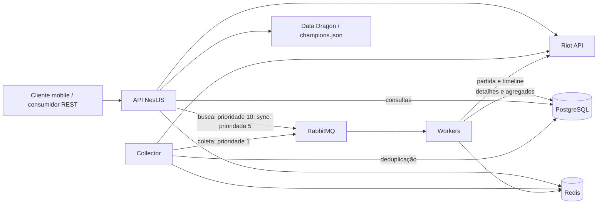

# Guia de entrada — High BR LoL Graph

Levantamento do código local em 18/09/2026, referência Git `30b212b`. Este documento descreve a implementação encontrada; diferenças em relação ao README estão explicitadas. Não houve execução da aplicação integrada nem consulta ao ambiente de produção.

Atualização: a ingestão e os agregados foram substituídos pelo [processamento confiável](PROCESSAMENTO-CONFIAVEL.md). Consulte esse guia para o comportamento atual de persistência, falhas, recuperação, reconstrução e validação; as descrições desses pontos neste levantamento são históricas.

## 1. Produto e escopo

Backend de análise de League of Legends, voltado ao servidor brasileiro e ao consumo por um app mobile. Busca jogadores por Riot ID, importa partidas, transforma timelines em dados analíticos e oferece perfis, históricos, estatísticas de campeões e comparações entre jogadores.

O workspace contém o repositório `high-br-lol-graph`. Não há frontend/mobile neste checkout. A interface implementada é REST; o nome “Graph” não corresponde a uma API GraphQL nem a um banco de grafos.

As estatísticas representam a amostra de partidas efetivamente importadas. A coleta de jogadores de elo alto e as buscas manuais alimentam o mesmo banco; os resultados globais não têm isolamento por elo. “ALL” significa todos os patches armazenados, não necessariamente todo o histórico do jogador na Riot.

Conceitos usados no domínio:

| Termo | Significado no código |
|---|---|
| Riot ID | `gameName` + `tagLine`, usados na busca |
| PUUID | Identificador do jogador, usado nas chaves e nas rotas |
| matchId | Identificador de partida, como `BR1_...` |
| patch | Primeiros dois componentes de `gameVersion`; `ALL` é o agregado entre patches |
| queueId | Modalidade; o código trata `420` como Ranked Solo/Duo e `440` como Flex |
| role | Posição do jogador, recebida da Riot; há divergência `MIDDLE`/`MID` nos filtros |
| KDA | `(kills + assists) / max(deaths, 1)` |
| DPM / GPM / CSPM | Dano a campeões, ouro e farm por minuto |
| CSD@15 / GD@15 / XPD@15 | Diferenças de farm, ouro e experiência contra o adversário de mesma posição aos 15 minutos |

## 2. Arquitetura e processos

É uma aplicação NestJS modular com processamento assíncrono por fila. O mesmo código e a mesma imagem são executados em modos diferentes. Todos compartilham PostgreSQL, Redis e RabbitMQ.



| Modo | Comportamento em `main.ts` |
|---|---|
| `APP_MODE=API` | HTTP em `PORT`, padrão 3000; documentação Scalar em `/reference` |
| `APP_MODE=WORKER` | Consome RabbitMQ, ACK manual, `prefetchCount: 1`; não abre listener HTTP |
| `APP_MODE=COLLECTOR` | HTTP em `COLLECTOR_PORT`, padrão 3001; serviços de coleta carregados |
| Ausente/outro | HTTP em `PORT`, padrão 3000; não configura `/reference` nem consumidor RMQ |

**A separação de modos está no bootstrap, não na composição de módulos.** `AppModule` importa todos os módulos e ativa o scheduler em todos os modos. Portanto API e Collector expõem os mesmos controllers HTTP; o cron também é registrado nos workers. Não há verificação de `APP_MODE` no método agendado.

Stack observada: Node 20 nas imagens/CI; TypeScript, NestJS 11, Express, Prisma 6, PostgreSQL 15, Redis 7 com ioredis, RabbitMQ 3.13 com amqplib/Nest microservices, Axios/RxJS, class-validator/class-transformer, OpenAPI/Scalar, Pino e Jest/Supertest. `package-lock.json` fixa as versões instaláveis; por exemplo, Nest core 11.1.6, Prisma 6.16.3 e TypeScript 5.9.2.

Referências: [bootstrap](../src/main.ts), [módulo raiz](../src/app.module.ts), [dependências](../package.json).

## 3. Organização do código

```text
src/
  main.ts                   Inicialização e escolha do modo
  app.module.ts             Composição de todos os módulos
  app.controller.ts         GET /health
  core/
    config/                 Leitura do .env via ConfigModule global
    prisma/                 Conexão PostgreSQL e PrismaClient
    redis/                  Cliente Redis compartilhado
    lock/                   Locks distribuídos via SET NX PX
    queue/                  Conexão RabbitMQ e publicação com prioridades
    riot/                   Cliente Riot, retry, rate limiter, DTOs e parsers
    data-dragon/            Catálogo local, versões e URLs de imagens
    stats/                  Atualização de agregados por jogador
    logger/                 Pino e contexto de trace ID
    interceptors/           Conversão de BigInt para JSON
  modules/
    players/                Busca, perfil, histórico, estatísticas e sync
    matches/                Detalhes, timelines, builds e desempenho
    champions/              Catálogo e patches
    stats/                  Estatísticas globais e tier list
    analytics/              Comparação entre dois jogadores
    collector/              Descoberta de partidas e controles de coleta
    worker/                 Consumo, transformação e persistência
    admin/                  Controles de rate limit e collector
prisma/
  schema.prisma             Modelo atual: 7 tabelas
  migrations/               9 migrations, uma delas vazia
test/
  helpers/                  Aplicação de teste e mocks
  fixtures/                 Dados reutilizados em testes
  jest-e2e.json             Configuração dos testes HTTP
.github/workflows/deploy.yml Pipeline de produção
```

O padrão predominante é `controller → service → repository → Prisma`. Arquivos em `pure/` contêm cálculos, mapeamentos e transformações sem infraestrutura. DTOs definem contratos de entrada/saída e parte da validação. Há exceções: agregações e `TierRankService` acessam Prisma diretamente.

Os testes ficam principalmente ao lado do código. Existem dois `StatsModule`: `core/stats` escreve agregados de jogadores; `modules/stats` atende consultas globais de campeões. Também existem dois `MatchRepository`, cada um no seu módulo.

O parser ativo de partidas do worker é [worker/pure/match.parser.ts](../src/modules/worker/pure/match.parser.ts). `core/riot/match-parser.service.ts` continua registrado, mas não é o parser utilizado nesse fluxo. O DTO de matchup também permanece no código, sem endpoint correspondente.

## 4. Fluxos de ponta a ponta

### Busca de jogador

1. `POST /api/v1/players/search` recebe `{ "gameName": "Nome", "tagLine": "BR1" }`.
2. Consulta Account-V1 para resolver PUUID, depois Summoner-V4 e League-V4 no servidor `br1`.
3. Seleciona os dados de `RANKED_SOLO_5x5` para o perfil.
4. Busca até 20 IDs de partidas nas Américas, **sem filtro de queue**.
5. Compara os IDs com `matches`; publica os ausentes com prioridade 10.
6. Faz upsert de `users` e retorna identificação, ícone, nível e `matchesEnqueued`.

O retorno não espera o processamento das partidas. Perfil pode estar disponível enquanto resumo/histórico ainda estão incompletos. `GET /players/:puuid/status` consulta novamente a Riot e compara as 20 partidas com o banco; esse polling também consome a cota externa.

Referências: [busca](../src/modules/players/services/player-search.service.ts), [perfil/status](../src/modules/players/services/player-profile.service.ts).

### Sincronização de histórico

1. `POST /players/:puuid/sync` exige registro em `users`, normalmente criado pela busca.
2. Se o Redis já indicar `SYNCING`, retorna o estado existente.
3. Busca até 100 partidas, `start=0`, `queue=420`. Não pagina todo o histórico.
4. Registra no Redis o estado e o conjunto completo de IDs retornados, com TTL de 1800 segundos.
5. Publica somente os IDs ausentes do banco, prioridade 5.
6. `GET /players/:puuid/sync-status` conta os IDs já persistidos e muda o estado para `DONE` quando atinge o total.

Estados implementados: `IDLE`, `SYNCING`, `DONE`. O worker não atualiza esse status diretamente. A conclusão é detectada na consulta; após expiração o status volta a `IDLE`. A contagem comprova existência da partida, não integridade de todos os agregados.

Referências: [orquestração](../src/modules/players/services/sync-orchestrator.service.ts), [status](../src/modules/players/services/sync-status.service.ts), [chaves/TTL](../src/modules/players/pure/sync-state.ts).

### Coleta automática/manual

Busca Challenger, Grandmaster e Master de Ranked Solo/Duo no Brasil, unifica os PUUIDs, busca 20 partidas recentes de cada jogador sem filtrar queue e enfileira IDs ainda ausentes do banco com prioridade 1.

Configuração compartilhada em Redis: `collector:enabled`, `collector:start_hour`, `collector:end_hour` e `collector:last_run`. Variáveis de ambiente inicializam essas chaves somente quando ausentes. Defaults: desabilitado, janela de 1h até antes das 8h. A janela usa o horário local do processo, sem timezone explícito no cron.

O README informa execução a cada 30 minutos, mas a expressão no código é `0 */30 * * *`: cinco campos, com o passo no campo de **horas**, não de minutos. Pela expressão, o disparo ocorre à meia-noite, fora da janela padrão. Isso precisa ser corrigido/validado antes de depender da coleta automática.

O trigger manual ignora a flag e a janela; ele aguarda toda a coleta antes de responder. `isRunning` protege apenas a instância local. Desabilitar a flag não cancela uma coleta em andamento. O endpoint administrativo da API executa o collector dentro do processo da API, sem encaminhar uma chamada ao container collector.

Referências: [scheduler/trigger](../src/modules/collector/services/collector.service.ts), [pipeline](../src/modules/collector/services/collector-pipeline.service.ts), [configuração](../src/modules/collector/services/collector-config.service.ts).

### Worker e consistência

1. Recebe `{ pattern: "match.collect", data: { matchId, traceId? } }`.
2. Se a partida já existe, encerra com sucesso.
3. Busca detalhes e timeline em paralelo, duas chamadas à Riot antes de retries.
4. Relaciona IDs dos participantes da timeline com PUUIDs.
5. Extrai estatísticas finais, gráficos, posições, itens e habilidades.
6. Salva `Match`, `MatchTeam` e `MatchParticipant` em uma transação.
7. Atualiza `ChampionStats` e depois `PlayerStats`/`PlayerChampionStats`, fora dessa transação.
8. Confirma a mensagem; erros propagados causam `nack(..., false, false)`, sem requeue.

O consumidor aceita também `user.update`, mas os três métodos atuais de publicação usam **`match.collect`**, mudando apenas a prioridade.

Duplicatas são tratadas pela consulta prévia e pelo erro Prisma `P2002`. Não há deduplicação dos IDs que ainda estão na fila. Não há dead-letter queue configurada no repositório. Erros individuais de agregação são logados e absorvidos; uma partida pode receber ACK mesmo com agregados incompletos. Reenviar a partida não repara isso, porque a presença em `matches` faz o worker ignorá-la.

Referências: [worker](../src/modules/worker/services/worker.service.ts), [persistência](../src/modules/worker/services/match-persistence.service.ts), [ACK/NACK](../src/modules/worker/worker.controller.ts), [publicação](../src/core/queue/queue.service.ts).

## 5. Modelo de dados

| Modelo/tabela | Chave e responsabilidade |
|---|---|
| `Match` / `matches` | `matchId`; criação em BigInt, duração, modo, queue, versão e mapa |
| `MatchParticipant` / `match_participants` | `(matchId, puuid)`; campeão, posição, resultado, métricas, arrays e JSONs da timeline |
| `MatchTeam` / `match_teams` | ID incremental; time, vitória, bans e campo JSON de objetivos |
| `User` / `users` | `puuid`; Riot ID, região, nível, ícone e dados ranqueados; unique em `(gameName, tagLine, region)` |
| `ChampionStats` / `champion_stats` | Unique `(championId, patch, queueId)`; agregados globais por campeão |
| `PlayerStats` / `player_stats` | Unique `(puuid, patch, queueId)`; resumo, posições e top 5 campeões |
| `PlayerChampionStats` / `player_champion_stats` | Unique `(puuid, championId, patch, queueId)`; desempenho por campeão e diferenças aos 15 min |

`Match` tem relações 1:N com participantes e times, com delete em cascata. PUUIDs em participantes/agregados não têm FK para `User`; processar uma partida pode gerar estatísticas para jogadores que nunca foram buscados e não possuem perfil em `users`.

Arrays `goldGraph`, `xpGraph`, `csGraph` e `damageGraph` usam o índice como minuto. JSONs armazenam posições de abates/mortes/wards, caminho amostrado, itens, runas, challenges e pings. A timeline bruta completa não é persistida como documento único.

As atualizações calculam médias incrementais e gravam versões `ALL` e patch específico para cada jogador. O tier/rank de campeão retornado é calculado durante a leitura, com mínimo de 50 jogos; pesos de win rate, ban rate, pick rate, KDA, DPM, GPM e CSPM, ajuste por amostra e possível mistura 70% patch atual/30% anterior. Os valores `tier/rank` persistidos começam em `C/0` e não são a fonte final desse cálculo.

Índices ajudam consultas por PUUID, campeão, `(puuid, championId)`, `(puuid, role)` e `(queueId, gameCreation DESC)`. Consultas de distribuição por posição e atividade usam SQL parametrizado; o heatmap de atividade usa explicitamente `America/Sao_Paulo`.

Referências: [schema](../prisma/schema.prisma), [agregação](../src/core/stats/player-stats-aggregation.service.ts), [tier/rank](../src/modules/stats/services/tier-rank.service.ts).

## 6. Inventário completo de endpoints

São **32 rotas HTTP declaradas em controllers**, mais a interface `/reference` montada no modo API. A base de negócio é `/api/v1`, escrita nos controllers; `/health` fica fora dela. Não há autenticação/guards implementados nas rotas inspecionadas.

GETs usam sucesso HTTP 200. POSTs usam o padrão Nest 201, inclusive onde a anotação OpenAPI diz 200; os testes HTTP existentes esperam 201. Validação global transforma inputs e rejeita propriedades não permitidas nos DTOs. Parâmetros recebidos como strings soltas não recebem automaticamente as mesmas regras dos DTOs.

### Players — `/api/v1/players`

| Método | Caminho relativo | Entrada e comportamento |
|---|---|---|
| POST | `/search` | Body `gameName`, `tagLine`; atualiza perfil e enfileira até 20 partidas novas |
| GET | `/:puuid` | Perfil salvo; 404 se não existe em `users` |
| GET | `/:puuid/status` | Compara últimas 20 partidas da Riot com o banco; `IDLE`, `UPDATING` ou `ERROR` |
| GET | `/:puuid/summary` | `patch` opcional, padrão `ALL`; resumo dos agregados; 404 se ausentes |
| GET | `/:puuid/champions` | `patch=ALL`, `role`, `limit` (padrão 10, teto 50), `sortBy=games/winRate/kda` |
| GET | `/:puuid/roles` | `patch=ALL`; partidas, participação, vitórias, derrotas, win rate e KDA por posição |
| GET | `/:puuid/activity` | `patch=ALL`; heatmap com 168 células e insights de atividade |
| GET | `/:puuid/matches` | Histórico leve; filtros e paginação descritos abaixo |
| POST | `/:puuid/sync` | Sem body; enfileira até 100 partidas Solo/Duo e retorna progresso inicial |
| GET | `/:puuid/sync-status` | Progresso por Redis + banco, sem consulta à Riot |

Histórico aceita `queueId=420`, `championId`, `role`, `cursor`, `limit=20` (1–50), `page=1`, `startDate`, `endDate` (timestamps em ms), `result=win/loss`, `sortBy=recent/kda/kills/damage`. Se houver cursor ele prevalece; sem cursor o default `page=1` seleciona paginação por offset. Retorno: `{ puuid, matches, nextCursor, hasMore }`. A lista não inclui gráficos completos. Não existe filtro `patch` nessa rota.

### Matches — `/api/v1/matches`

| Método | Caminho relativo | Comportamento |
|---|---|---|
| GET | `/:matchId` | Partida completa, times e participantes; `gameCreation` como string |
| GET | `/:matchId/timeline/gold` | Ouro por time/minuto, diferença, maior vantagem e primeiro swing acima de 3000 |
| GET | `/:matchId/timeline/events` | Eventos de abates, mortes, wards e objetivos; ver incompatibilidade de objetivos abaixo |
| GET | `/:matchId/builds` | Histórico de itens e aproximação da build final |
| GET | `/:matchId/performance/:puuid` | Métricas por minuto e comparação com o adversário de mesma posição |

### Champions, Stats e Analytics

| Método | Caminho completo | Entrada e comportamento |
|---|---|---|
| GET | `/api/v1/champions` | Catálogo local enriquecido com URLs de imagens |
| GET | `/api/v1/champions/current-patch` | Consulta versões do Data Dragon; retorna `patches` e `current` |
| GET | `/api/v1/stats/champions` | `patch` obrigatório no formato numérico `X.Y`; `page=1`, `limit=20` (1–200), `sortBy=winRate`, `order=desc` |
| GET | `/api/v1/stats/champions/:championName` | `patch` esperado; estatísticas, imagens, tier e rank de um campeão |
| GET | `/api/v1/stats/processed-matches` | `patch` opcional; contagem de registros de partidas |
| GET | `/api/v1/analytics/compare` | `heroPuuid` e `villainPuuid` obrigatórios; `role`, `championId`, `patch=ALL` opcionais |

`sortBy` dos campeões globais aceita `winRate`, `gamesPlayed`, `championName`, `banRate`, `pickRate`, `kda`, `dpm`, `cspm`, `gpm`; ordem `asc/desc`. Retorno paginado: `{ data, total, page, limit }`.

Analytics compara agregados de dois jogadores, mesmo que nunca tenham disputado a mesma partida. Retorna métricas gerais, fase de lane, médias das timelines de CS/ouro e insights por regras fixas; não há modelo de IA nesse cálculo. O campo `winner` da comparação usa apenas win rate, com empate favorecendo `hero`.

### Operação

| Método | Caminho completo | Comportamento |
|---|---|---|
| GET | `/health` | `{ status: "ok", timestamp }`; não testa dependências |
| GET | `/api/v1/collector/status` | Flag, execução local, última execução e janela |
| POST | `/api/v1/collector/enable` | Habilita flag compartilhada |
| POST | `/api/v1/collector/disable` | Desabilita flag compartilhada |
| POST | `/api/v1/collector/trigger` | Executa coleta manual no processo que recebeu a chamada |
| GET | `/api/v1/admin/rate-limit` | Consulta contador padrão; ver limitação abaixo |
| POST | `/api/v1/admin/rate-limit/reset` | Limpa contadores Redis de rate limit de todas as keys |
| GET | `/api/v1/admin/collector` | Mesmo serviço de status do collector |
| POST | `/api/v1/admin/collector/enable` | Mesmo serviço de enable |
| POST | `/api/v1/admin/collector/disable` | Mesmo serviço de disable |
| POST | `/api/v1/admin/collector/trigger` | Mesmo serviço de trigger |

## 7. Integrações, caches e observabilidade

**Riot:** Account-V1 e Match-V5 usam normalmente `americas.api.riotgames.com`; Summoner-V4 e League-V4 usam `br1.api.riotgames.com`. Autenticação de saída via `X-Riot-Token`. O cliente também contém consulta League por summoner ID, embora a busca atual use PUUID.

O limitador local usa Redis, janela móvel de 120 segundos e máximo de 100 requisições por API key, identificada por hash. Esses são parâmetros do projeto, não uma validação da cota real da credencial. Workers que usam a mesma key compartilham o contador; o collector usa a key do primeiro worker no Compose. Cada chamada passa pelo limitador dentro do retry. Há até 5 tentativas, backoff com jitter limitado a 10 segundos e timeout HTTP de 5 segundos. Não há classificação de erros permanentes nem respeito explícito a `Retry-After`.

**RabbitMQ:** uma fila durável, prioridade máxima 10, mensagens persistentes. `RABBITMQ_QUEUE` tem fallback `default_queue` no publisher, mas é obrigatório no bootstrap do worker. O publisher usa canal comum e `sendToQueue`, sem confirmação do broker; o retry de conexão é de inicialização, não um mecanismo completo de recuperação da conexão de publicação.

**Redis:** coordenação do rate limit/locks, configuração do collector e estado temporário de sync. Não foi encontrada uma camada geral de cache de respostas REST. O perfil “cacheado” está em PostgreSQL.

**Data Dragon:** catálogo carregado de `champions.json` no startup. O arquivo presente contém 172 campeões da versão `15.19.1`; não há rotina automática de atualização desse arquivo. Versão usada nas imagens tem cache em memória sem TTL; `/champions/current-patch` consulta a lista externa diretamente. Portanto catálogo, imagens e versão reportada podem ter origens/idades diferentes.

**Logs:** Pino, JSON em produção e pretty em desenvolvimento. Default real de nível `info`, ajustável por `LOG_LEVEL`. Middleware cria/aceita `x-trace-id`; publisher pode colocá-lo no payload e worker recupera o contexto via AsyncLocalStorage. Nem todo log inclui automaticamente o trace ID. Redação configurada para Authorization, mas a conexão RabbitMQ registra a URL de conexão, que pode conter credenciais.

## 8. Configuração, desenvolvimento e deploy

| Variáveis | Uso |
|---|---|
| `APP_MODE`, `PORT`, `COLLECTOR_PORT` | Modo e listeners |
| `DATABASE_URL` | Conexão utilizada pelo Prisma |
| `POSTGRES_HOST/PORT/USER/PASSWORD/DB` | Configuração/interpolação do Compose |
| `REDIS_HOST`, `REDIS_PORT` | Conexão Redis; defaults `redis:6379` |
| `RABBITMQ_URL`, `RABBITMQ_QUEUE` | Conexão/fila; obrigatórios explicitamente no worker |
| `RABBITMQ_DEFAULT_USER/PASS`, `RABBITMQ_HOST` | Broker e fallback de URL do publisher |
| `RIOT_API_KEY` | Credencial usada pelo processo |
| `RIOT_API_KEY_WORKER_1/2` | Compose mapeia para `RIOT_API_KEY` dos workers e collector |
| `COLLECTOR_ENABLED/START_HOUR/END_HOUR` | Valores iniciais das chaves Redis |
| `RUN_MIGRATIONS=true` | Entry point executa `prisma migrate deploy`; configurado na API |
| `NODE_ENV`, `LOG_LEVEL` | Ambiente e logs |

O `.env.example` está incompleto para a stack: faltam `RABBITMQ_URL`, `RABBITMQ_QUEUE`, keys específicas dos workers e opções do collector. Para execução fora do Docker, também é preciso definir `DATABASE_URL` e usar hosts acessíveis do host, normalmente `localhost`, em vez dos nomes internos da rede Compose.

Roteiro de desenvolvimento, depois de completar a configuração:

```sh
cd high-br-lol-graph
cp .env.example .env
# Preencher .env, incluindo as variáveis ausentes descritas acima.
docker compose up -d --build
```

O Compose de desenvolvimento sobe PostgreSQL, RabbitMQ, Redis, API, dois workers e collector, com bind mount e `start:dev`. A API é acessível na porta 3000; `/reference` apresenta a especificação gerada dos controllers. O listener 3001 do collector não tem porta publicada no Compose.

Para trabalhar com processos Node no host, as etapas são instalar dependências (`npm ci`), gerar Prisma (`npx prisma generate`), preparar banco local (`npx prisma migrate deploy`) e iniciar terminais com `APP_MODE=API npm run start:dev` e `APP_MODE=WORKER npm run start:dev`. O collector pode ter terminal próprio, mas o carregamento global do scheduler merece correção antes de habilitar a coleta em várias instâncias.

As imagens usam Node 20; o Node disponível durante este levantamento é 26.8.2. O Dockerfile de produção faz build em dois estágios, copia `dist`, catálogo e Prisma e executa como usuário não root.

Pipeline declarado em [deploy.yml](../.github/workflows/deploy.yml): push na branch `prod` → testes unitários/HTTP → build/push no GHCR → Trivy informativo → inicia VM GCP por endpoint Cloud Run → deploy SSH com Compose → verifica `/health` → tenta rollback se falhar → **solicita desligamento da VM ao final**, inclusive após sucesso. Não se deve interpretar esse pipeline como garantia de disponibilidade contínua.

No Compose de produção, PostgreSQL tem volume e Redis usa AOF/volume; RabbitMQ não tem volume declarado. A API não recebe `RIOT_API_KEY` na definição versionada; sem configuração adicional externa, busca/status/sync não conseguem consultar a Riot. A imagem final não copia `.env`. O mecanismo de rollback salva o nome de imagem, normalmente uma tag mutável `prod-latest`, portanto não assegura retorno ao conteúdo anterior.

## 9. Pontos que exigem atenção no código atual

Os itens abaixo são observações do código local, não confirmação de incidentes em produção. Nenhuma correção foi aplicada durante o levantamento.

| Área | Evidência e efeito |
|---|---|
| Agendamento | Expressão do cron está no campo de horas; não implementa os 30 minutos descritos. Com janela padrão, o disparo de meia-noite é descartado. [Código](../src/modules/collector/services/collector.service.ts) |
| Isolamento de processos | Todos carregam scheduler/collector; flag em Redis é global e `isRunning` é local. Após corrigir/habilitar cron, várias instâncias podem coletar simultaneamente. [Código](../src/app.module.ts) |
| Mistura de modalidades | Busca/coleta importam sem filtro de queue; agregador de jogadores grava sempre `queueId: 420`, sem verificar a queue da partida. Resumos Solo/Duo podem incluir outras modalidades. [Código](../src/core/stats/player-stats-aggregation.service.ts) |
| Integridade dos agregados | Atualizações leem valor atual e depois fazem upsert com números absolutos; workers concorrentes podem sobrescrever incrementos. Agregados ficam fora da transação principal e não têm reconstrução/reparo implementado. [Código](../src/modules/worker/services/match-persistence.service.ts) |
| Objetivos da timeline | Parser extrai eventos, mas persistência salva `team.objectives` do Match-V5, um objeto de totais, em `objectivesTimeline`. Leitura espera array e chama `.map`; dados desse fluxo podem causar erro em `/timeline/events`. [Gravação](../src/modules/worker/pure/match.parser.ts), [leitura](../src/modules/matches/pure/timeline-events.mapper.ts) |
| Analytics com `ALL` | Valor padrão `ALL` é passado a `gameVersion.startsWith('ALL')`, em vez de omitir o filtro; timelines retornam vazias para versões normais. `role` filtra timelines, mas não os agregados gerais/laning da mesma resposta. [Código](../src/modules/analytics/repositories/analytics.repository.ts) |
| Posição central | Parser mantém `teamPosition` recebido; fixture contém `MIDDLE`, enquanto DTOs de histórico/comparação aceitam `MID`. Filtro pode não encontrar registros de mid. [Parser](../src/modules/worker/pure/match.parser.ts), [DTO](../src/modules/players/dto/player-match.dto.ts) |
| Métricas globais incompletas | Worker inicializa `banRate`, `pickRate`, `cspm` em zero e não os calcula posteriormente. São entradas do score de tier. Consultas globais por patch não filtram queue e podem retornar várias linhas do mesmo campeão. [Persistência](../src/modules/worker/services/match-persistence.service.ts), [consultas](../src/modules/stats/repositories/champion-stats.repository.ts) |
| Timeline indisponível | `getTimeline` reconhece 404 somente como AxiosError, mas o interceptor converte 404 em NotFoundException. O caminho previsto de retornar null/ignorar partida pode não ser alcançado na integração real. [Cliente](../src/core/riot/riot.service.ts), [interceptor](../src/core/riot/riot.module.ts) |
| Serialização de datas | Interceptor de BigInt reconstrói qualquer objeto via `Object.keys`; um `Date` vira `{}`. Perfil/resumo retornam Dates que passam por esse interceptor na aplicação real. Helper de testes HTTP não instala esse interceptor. [Código](../src/core/interceptors/bigint.interceptor.ts) |
| Precisão das análises | Wards têm posição `(0,0)`; `finalBuild` usa últimas seis compras distintas, sem reconstruir inventário; `winner` da timeline de ouro é quem termina com mais ouro, não o campo real de vitória. Solo kills/deaths na comparação são sempre zero. [Parser](../src/core/riot/timeline-parser.service.ts), [builds](../src/modules/matches/pure/builds.mapper.ts), [ouro](../src/modules/matches/pure/gold-calculator.ts) |
| Paginação | Cursor usa data de criação mesmo ao ordenar por KDA/kills/dano, incompatível com esses critérios; sem desempate único também pode omitir partidas com timestamp igual. [Código](../src/modules/players/pure/match.mapper.ts) |
| Patches | Filtros por prefixo podem confundir, por exemplo, `15.1` com `15.10`; cálculo do patch anterior usa padding e transição fixa de temporada. [Consultas](../src/modules/players/repositories/player-stats.repository.ts), [tier](../src/modules/stats/services/tier-rank.service.ts) |
| Top campeões/data | Top 5 é truncado a cada atualização, perdendo histórico de campeões fora da lista; `lastPlayedAt` recebe hora de processamento, não a hora da partida. [Código](../src/core/stats/player-stats-aggregation.service.ts) |
| Estado de sync | Check de `SYNCING` e gravação não são atômicos; chamadas simultâneas podem duplicar publicações. Novo sync adiciona IDs ao set anterior sem limpá-lo. Falhas de mensagens não têm estado de erro específico; podem permanecer em sync até TTL. [Código](../src/modules/players/services/sync-orchestrator.service.ts) |
| Contador administrativo | Admin chama `getStatus()` sem key e lê `riot_requests:default`, enquanto chamadas reais usam hash da key; status não representa automaticamente os workers. Reset limpa os contadores locais, não a cota no servidor Riot. [Código](../src/modules/admin/admin.controller.ts) |
| Proteções HTTP/saída | Não há guards de autenticação para admin/collector e CORS reflete a origem. Cliente Riot desabilita validação do certificado TLS (`rejectUnauthorized: false`). [Bootstrap](../src/main.ts), [RiotModule](../src/core/riot/riot.module.ts) |
| Evolução de banco | Migration adiciona `damageTaken NOT NULL` sem default/backfill; aplicar em tabela já populada exige tratamento. Migration de pivot elimina tabelas/campos antigos. [Migration](../prisma/migrations/20260211020137_add_damage_taken/migration.sql) |

## 10. Testes e verificação deste levantamento

Foram inventariados 182 arquivos TypeScript em `src`, incluindo **50 arquivos de testes unitários** e **8 arquivos de testes HTTP**. Isso é contagem de arquivos, não quantidade de casos nem cobertura medida.

Comandos disponíveis: `npm test -- --runInBand`, `npm run test:e2e -- --runInBand`, `npm run test:cov`, `npm run build`. `npm run lint` usa `--fix` e altera arquivos.

Testes unitários usam mocks para serviços/repositórios e verificam funções puras. Os testes chamados e2e instanciam controllers/módulos com serviços ou infraestrutura substituídos; não exercitam o caminho completo Riot → RabbitMQ → worker → PostgreSQL/Redis. O helper instala ValidationPipe, mas não reproduz todo o bootstrap.

Este levantamento leu bootstrap, módulos, controllers, DTOs, serviços, repositórios, parsers, schema/migrations, configurações de testes e deploy. Conferiu o inventário de rotas por extração dos decorators e os formatos das fixtures. Duas funções puras foram executadas diretamente com Node: cálculo do vencedor por ouro e montagem de build; a segunda manteve um item vendido na build, confirmando a limitação descrita.

Não foram executados Jest, build, migrations ou containers: o checkout não possui `node_modules` e não foi preparado um ambiente integrado. Não foram consultadas credenciais, Riot API real ou infraestrutura de produção.

## 11. Ordem de leitura para contribuir

1. [main.ts](../src/main.ts) e [app.module.ts](../src/app.module.ts): bootstrap e composição real.
2. [schema.prisma](../prisma/schema.prisma): dados de origem e agregados disponíveis.
3. [PlayersController](../src/modules/players/players.controller.ts) e [PlayerSearchService](../src/modules/players/services/player-search.service.ts): entrada do usuário.
4. [QueueService](../src/core/queue/queue.service.ts), [WorkerController](../src/modules/worker/worker.controller.ts) e [WorkerService](../src/modules/worker/services/worker.service.ts): caminho assíncrono.
5. [MatchPersistenceService](../src/modules/worker/services/match-persistence.service.ts) e [PlayerStatsAggregationService](../src/core/stats/player-stats-aggregation.service.ts): consistência e métricas.
6. Serviços/repositórios de `players`, `matches`, `stats` e `analytics`: como o dado chega ao cliente.
7. [Compose de desenvolvimento](../docker-compose.yml), [Compose de produção](../docker-compose.prod.yml) e [workflow](../.github/workflows/deploy.yml): execução e operação.

Para investigar números divergentes, comece pela partida/participante persistidos, confira a queue e o patch, depois compare os agregados. Para investigar histórico que não chega, acompanhe busca/sync, publicação na fila, logs do worker e presença em `matches`; o status HTTP sozinho não comprova que a ingestão funciona.
